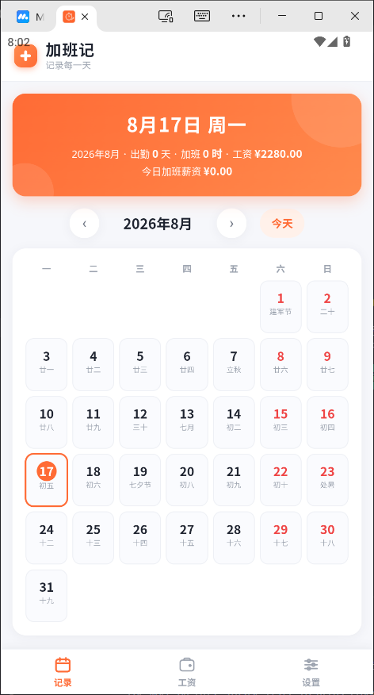
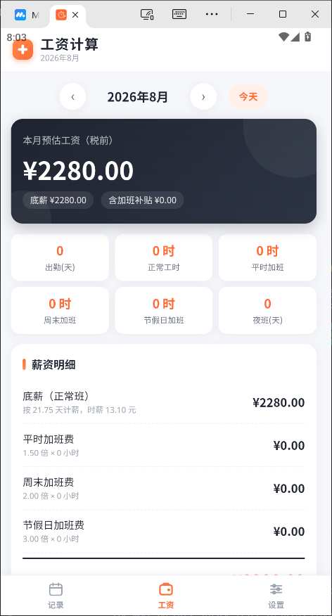
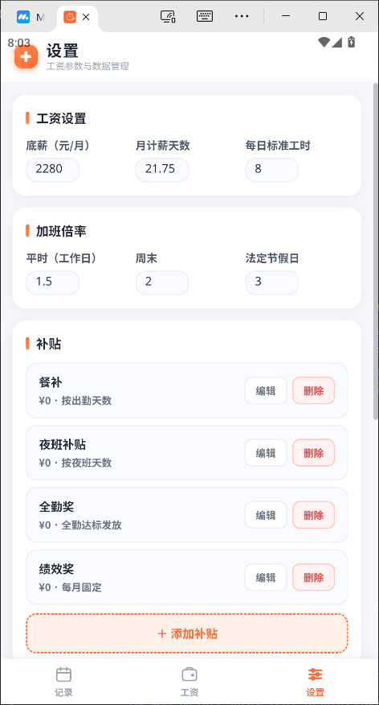

# 加班记（免费 · 无广告）

专为工厂上班族打造的加班工时记录与月薪计算工具。记录每天的正常班与加班小时数，自动按平时（1.5 倍）/ 周末（2 倍）/ 节假日（3 倍）计算加班费并汇总月薪。

- 完全免费、无广告、无需联网、不注册不登录
- 所有数据仅保存在手机本机（localStorage），不会上传任何服务器
- 支持添加到手机桌面，像 App 一样全屏使用；支持离线使用
- 已打包成安卓 APK（正式签名版），可安装到手机使用

## 功能一览

| 页面 | 功能 |
| --- | --- |
| 记录 | 日历视图点选任意日期，直接填写该天的正常班/加班小时数；自动按日期判定平时/周末，可手动改为节假日；支持白班/夜班/休息/请假班次选择与备注；顶部展示当月出勤天数、正常班、加班合计、预估工资 |
| 工资 | 按月展示预估工资：底薪、平时/周末/节假日加班费、自定义补贴、扣款（每月固定/仅当月，如社保代扣、迟到罚款）、请假扣款，并附计算规则；可导出明细 CSV、复制工资单文本 |
| 设置 | 底薪、月计薪天数（21.75）、每日标准工时（8）、加班倍率；自定义补贴（按出勤天数/夜班天数/全勤达标/每月固定）；自定义扣款（每月固定/仅当月）；数据备份/导入/清空 |

## 界面预览

<p align="center">
  
  
  
</p>

## 计算方法

- 时薪 = 底薪 ÷ 月计薪天数（21.75）÷ 每日标准工时（8）
- 平时加班费 = 时薪 × 1.5 × 平时加班小时（工作日正常班超出 8 小时的部分也并入平时加班）
- 周末加班费 = 时薪 × 2 × 周末工时
- 节假日加班费 = 时薪 × 3 × 节假日工时
- 请假扣款 = 时薪 × 请假小时（请假时填写小时数，满 8 小时按一天扣 = 日薪，零头按小时扣）
- 其他扣款分两种：「每月固定」每月都扣（如社保、公积金、个税）；「仅当月」只在所选月份扣一次（如迟到罚款）
- 应发工资 = 底薪 + 各加班费 + 补贴 - 请假扣款 - 其他扣款

以上均为估算，具体以工厂结算为准。所有参数可在「设置」中调整。

## 如何使用

### 方式一：直接使用（推荐）

1. 用电脑浏览器打开 `index.html`，或在手机浏览器打开部署后的网址。
2. 打开后即可填写记录、查看工资。
3. 手机浏览器（Chrome / 华为浏览器 / 小米浏览器等）中，点浏览器菜单 →「添加到主屏幕 / 添加到桌面」，之后就能像 App 一样从桌面打开，且全屏无浏览器地址栏。

### 方式二：本地预览调试

项目为纯静态页面，无需安装任何依赖：

```bash
# 任选一种方式启动本地服务
npx http-server -p 8080
# 或
python -m http.server 8080
```

然后浏览器访问 `http://localhost:8080/`。

## 安卓 APK 打包（已完成）

**已打包完成**：正式签名版 APK 位于项目根目录 `jiayiban.apk`（约 3.4MB），可直接安装到手机（Android 7.0 及以上）。

- 包名：`com.jiayiban.app`
- 应用名：加班记
- 签名：正式签名（CN=jiayiban），有效期 100 年
- 技术方案：PWA + Capacitor 7 打包

### ⚠️ 重要：签名文件备份（必读）

正式签名文件是 **keystore 密钥库**，以后更新版本必须用**同一个** keystore 签名，否则无法覆盖安装（只能卸载重装，数据清空）。

| 项目 | 值 |
| --- | --- |
| keystore 文件 | `android\jiayiban-release.keystore`（2.7KB） |
| 密码 | `jiayiban123` |
| 别名 | `jiayiban` |

**请务必将 keystore 文件和本 README 一起备份**（网盘 / U 盘 / 微信收藏均可）。丢失签名 = 以后无法覆盖更新。

### 已有环境重新打包（本机快捷命令）

如果当前机器环境还在（JDK 21 + Android SDK 已装好）：

```bash
cd android
set JAVA_HOME=C:\setup\jdk-21.0.2
set ANDROID_HOME=C:\Android
gradlew assembleRelease
```

打包产物：`android\app\build\outputs\apk\release\app-release.apk`，复制到项目根目录替换 `jiayiban.apk` 即可。

> 网吧电脑重启后环境可能被还原，需按下方"从零搭建"恢复。

## 从零搭建打包环境（网吧新机器恢复用）

以下所有步骤在网吧电脑上从零执行，全部走**国内镜像**，不用科学上网。

### 1. 安装 JDK 21

- 下载（华为云镜像）：https://mirrors.huaweicloud.com/openjdk/21.0.2/openjdk-21.0.2_windows-x64_bin.zip
- 解压到 `C:\setup\jdk-21.0.2`（解压出的文件夹改名为 jdk-21.0.2）
- 设置环境变量：`JAVA_HOME = C:\setup\jdk-21.0.2`

> 注意：必须 JDK 21（Capacitor 编译要求），JDK 8 / 17 都会报「无效的源发行版」。

### 2. 安装 Android SDK

- 下载 commandlinetools（腾讯云镜像，约 153MB）：
  https://mirrors.cloud.tencent.com/AndroidSDK/commandlinetools-win-11076708_latest.zip
- 解压到 `C:\Android\cmdline-tools\latest`（注意层级：`C:\Android\cmdline-tools\latest\bin\sdkmanager.bat`）
- 设置环境变量：`ANDROID_HOME = C:\Android`
- 用 PowerShell 安装组件：

```powershell
$args = @('platform-tools','build-tools;34.0.0','build-tools;35.0.0','platforms;android-34','platforms;android-36')
& "C:\Android\cmdline-tools\latest\bin\sdkmanager.bat" $args
```

- 接受许可证：手动创建以下两个文件（sdkmanager 交互接受常常失败）：

`C:\Android\licenses\android-sdk-license` 内容：
```
24333f8a63b6825ea9c5514f83c2829b004d1fee
```

`C:\Android\licenses\android-sdk-preview-license` 内容：
```
84831b9409646a918e30573bab4c9c91346d8abd
```

### 3. 配置 npm 国内源（如需要）

```bash
npm config set registry https://registry.npmmirror.com
```

### 4. 修改 Gradle 使用国内镜像（关键）

项目已配好，若重新初始化需修改：

- `android\gradle\wrapper\gradle-wrapper.properties`：
  ```
  distributionUrl=https\://mirrors.cloud.tencent.com/gradle/gradle-8.14.3-all.zip
  ```
- `android\build.gradle`：在两个 `repositories` 块中加上（Tencent 镜像）：
  ```groovy
  maven { url 'https://mirrors.cloud.tencent.com/nexus/repository/maven-public/' }
  ```

### 5. 重新生成 android 工程（仅当 android 目录丢失时）

```bash
npm install @capacitor/core @capacitor/cli @capacitor/android
npx cap init "加班记" "com.jiayiban.app" --web-dir "www"
npx cap add android
```

> 注意：Capacitor 要求 `webDir` 必须是子目录，本项目用的是 `www`。`www` 目录内容是 `index.html`、`css/`、`js/`、`icons/`、`manifest.json`、`sw.js` 的拷贝，改完源代码后需 `npx cap sync android` 同步。

### 6. 配置正式签名

- 恢复 keystore：把备份的 `jiayiban-release.keystore` 放回 `android\` 目录
- 确保 `android\key.properties` 存在（内容如下，密码为 jiayiban123）：

```
storePassword=jiayiban123
keyPassword=jiayiban123
keyAlias=jiayiban
storeFile=jiayiban-release.keystore
```

- `android\app\build.gradle` 中签名配置已写好，无需改动

### 7. 打包

```bash
cd android
gradlew assembleRelease
```

## 文件结构

```
├── index.html            # 主页面
├── manifest.json         # PWA 配置（添加到桌面、图标）
├── sw.js                 # 离线缓存 Service Worker
├── css/style.css         # 样式
├── js/
│   ├── storage.js        # 数据存储（localStorage）
│   ├── calculator.js     # 工时与薪资计算引擎
│   └── app.js            # 页面与交互逻辑
├── icons/                # 应用图标（192 / 512）
├── www/                  # Capacitor 打包用的静态资源副本
├── android/              # 安卓工程
│   ├── jiayiban-release.keystore   # ⚠️ 正式签名文件（务必备份）
│   └── key.properties               # 签名配置
├── capacitor.config.json # Capacitor 配置
└── jiayiban.apk          # 已签名的正式版 APK
```

## 打包环境记录（2026-08-17）

- JDK：21.0.2，位于 `C:\setup\jdk-21.0.2`（华为云镜像下载）
- Android SDK：`C:\Android`（腾讯云镜像下载 commandlinetools）
- Gradle：8.14.3（腾讯云镜像）
- npm：registry 已设为 npmmirror
- 版本：versionCode 1 / versionName 1.0
- 上次打包：BUILD SUCCESSFUL，产物 `jiayiban.apk` 3.4MB

## 说明

- 数据存储于浏览器 localStorage，清除浏览器数据或卸载浏览器会导致记录丢失，建议定期在「设置 → 备份数据」导出 JSON 备份。
- 如需支持"每日多段加班""农历/法定节假日自动识别"等更多能力，可以继续在 `calculator.js` 中扩展。
- 修改源代码后需要更新 APK：备份数据 → 重新打包 → 手机覆盖安装（签名一致可覆盖，数据保留）。
